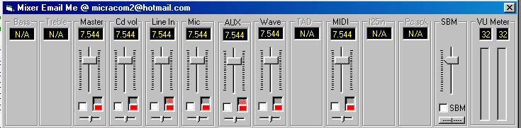



## \[JDP\] API Line Sound Mixer

### Description

Update to my mixer, now detects audio card devices and displays volumes for all available devices. Better code than last version. Control master, CD, Line, Aux, TAB, Mic Treble, Bass and more. This is all API and can be a little confusing to newbie’s. Open the systems sound mixer and use this app it will move the mixers vol’s as well as this apps.
 
### More Info
 

             |
---                |---
**Submitted On**   |2003-01-17 14:40:58
**By**             |[Jamie Pocock](https://github.com/Planet-Source-Code/PSCIndex/blob/master/ByAuthor/jamie-pocock.md)
**Level**          |Advanced
**User Rating**    |4.5 (45 globes from 10 users)
**Compatibility**  |VB 6\.0
**Category**       |[Complete Applications](https://github.com/Planet-Source-Code/PSCIndex/blob/master/ByCategory/complete-applications__1-27.md)
**World**          |[Visual Basic](https://github.com/Planet-Source-Code/PSCIndex/blob/master/ByWorld/visual-basic.md)
**Archive File**   |[\[JDP\]\_API\_153920242003\.zip](https://github.com/Planet-Source-Code/jamie-pocock-jdp-api-line-sound-mixer__1-42946/archive/master.zip)

